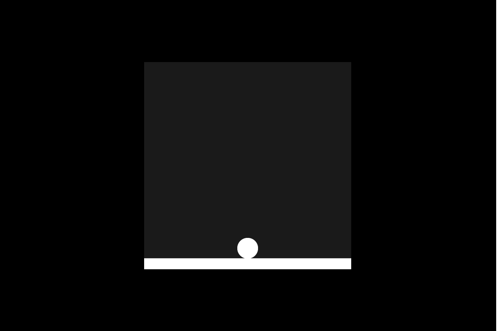

# Gravity
Gravity est une expérimentation pour une future plateforme jouant avec la gravité et la perspective.

Le monde dans lequel le joueur se déplace est un labyrinthe. Celui-ci devra se déplacer d'un point A à un point B en changeant ses angles de vue, ce qui lui permettra de voir différentes possibilités de déplacement. La gravité du joueur est liée à l'angle de vue. Ainsi, une caméra A aura un élément considéré comme un mur, qui sera un sol pour une caméra B.

Le déplacement du joueur se fait avec les flèches haut, bas, gauche et droite. Le changement de caméra se fait avec la touche espace.

-----

## Plateau exemple :

-----

## Principe de déplacement :

